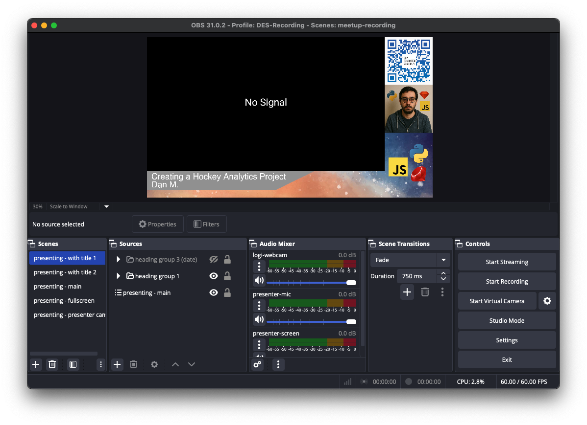

# Meetup Recording OBS Setup

A pre-configured OBS Studio setup for JS/PY/RB Meetup recordings.



🎬 [See a real example on YouTube](https://www.youtube.com/watch?v=V1W5v33yyt4&t=527s)

## Notes

- This setup is only confirmed to work on a M1 Mac. You may need to adjust encoding and/or other output settings for your specific hardware, but perhaps not.
- The setup script tries to generate a profile, scene collection, and macros (for the advanced scene switcher plugin) that will work as-is, but you do need to import each one manually.
- However, the scene collection should figure out the correct paths to images for you.

## Quick Start

See [hardware setup](docs/hardware-setup.md) for instructions plugging all the hardware in. The instructions below are primarily for setting up the OBS Studio configuration. 

Highly recommend doing all of this setup, including the hardware setup, a day or two before recording day to ensure everything works as expected and you understand how everything works.

1. **Clone this repository**:
   ```bash
   git clone <repository-url>
   cd meetup-recording
   ```

   OR

   ```bash
   gh repo clone <repository-url>
   cd meetup-recording
   ```

2. **Run the setup script**:
   ```bash
   chmod +x setup.sh
   ./setup.sh
   ```

3. **Follow the prompts** to:
   - Choose a profile name
   - Set your recordings directory
   - Generate customized OBS files

4. **Import into OBS Studio**:
   - Open OBS Studio
   - Go to **Profile > Import** and select the `generated/<profile_name>/profile/` folder
   - Go to **Scene Collection > Import** and select the generated `meetuprecording.json` file
   - (Optional) If using [Advanced Scene Switcher](https://obsproject.com/forum/resources/advanced-scene-switcher.395/), open the plugin import macros from the `generated/<profile_name>/macros/` folder. Note, you'll have to install the plugin first.

5. **Configure your audio and video sources** in OBS:

Due to the way devices are handlged, you will need to manually select the devices you want to use for the video sources. Unfortunately this also needs to be done **every time you connect the devices**. So, always check this stuff during setup before starting your recording.

Under the "Presenting - main" scene, select all the video sources like presenter screen and logi-webcam, open the properties, and select the correct device for each source.

## What Gets Generated

The setup script creates a `generated/[profile-name]/` folder containing:

```
generated/[your-profile-name]/
├── profile/           # OBS profile configuration
├── scene-collections/ # Scene collection with all layouts
├── images/           # Graphics and branding assets
└── macros/           # Advanced Scene Switcher macros (optional)
```

All file paths are automatically configured to work with your chosen recording directory and image locations.

## Scene Layouts

### Presenting - with title 1 & 2
- Main presentation area with presenter camera
- Rotating title displays at the bottom
- Branding (DES logo, JSPYRB logo)
- Background graphics

### Presenting - main
- Clean presentation view
- Presenter camera in corner
- Branding (DES logo, JSPYRB logo)
- No title overlay (for during presentations)

### Presenting - fullscreen
- Full-screen presenter display
- Audio from presenter microphone
- Minimal UI elements

### Presenting - presenter cam
- Full-screen presenter camera
- Perfect for speaker introductions or Q&A

## Audio Setup

The configuration includes:
- **Presenter microphone** with noise suppression filter and mono audio selected
- **Webcam audio** (if your camera has a microphone, should be muted)

## Customization

### Updating Text and Titles
Edit the text sources in OBS:
1. Go to the scene collection
2. Find text sources like "heading 1", "heading 2", "heading 3"
3. Update the text content for the event

## Advanced Scene Switcher Macros

The included macros provide:
- **Automatic card rotation** between different title/date&location cards. I recommend getting familiar with the advanced scene switcher interface to understand how these macros work, or simply disable them and use the one title card since this is just for extra flair.

To use the macros:
1. Install the Advanced Scene Switcher plugin for OBS
2. Import the macro files from the generated `macros/` folder
3. Enable or disable the macros as needed.

## License

This project is licensed under the MIT License - see the [LICENSE](LICENSE) file for details.