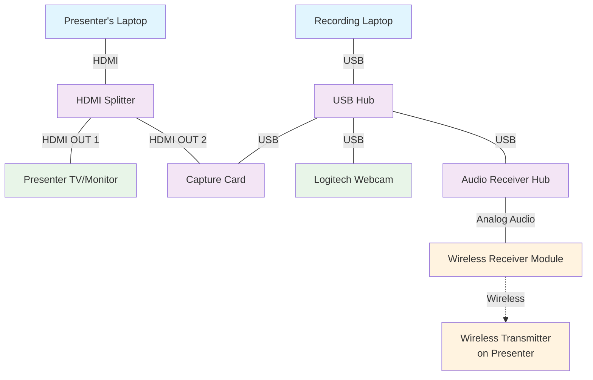

# Hardware Setup Guide

This document describes the complete hardware setup for recording meetups with the OBS configuration provided in this repository.

## Overview

The recording setup consists of three main subsystems:
- **Video capture**: Webcam and presenter screen capture
- **Audio capture**: Wireless microphone system
- **Display routing**: HDMI splitting for presenter display and recording

## Hardware List

### Components
- Recording laptop (only Mac tested)
- USB hub (powered required)
- Video capture card (e.g., AV.io 4K Video)
- HDMI splitter (1 input, 2 outputs)
- Logitech webcam (e.g., BRIO)
- Audio receiver hub
- Wireless microphone system (transmitter + receiver)

### Cables Required
- USB cables (multiple, various, one longer usb 3 type C for the webcam is ideal)
- HDMI cables (2-3 depending on setup, longer the better)

## Connection Diagram

## Step-by-Step Setup Instructions

### 1. USB Hub Setup
1. Connect the USB hub to your recording laptop
2. Ensure the hub is powered if using multiple high-power devices

### 2. Webcam Setup
1. Connect the Logitech webcam to the USB hub
2. Position the webcam to capture the presenter
3. Test the webcam in OBS to ensure proper framing

### 3. Video Capture Setup
1. Connect the capture card to the USB hub
2. Connect an HDMI cable from the HDMI splitter's second output to the capture card input
3. The capture card will appear as a video source in OBS

### 4. HDMI Display Routing
1. Connect the presenter's laptop to the HDMI splitter's input
2. Connect the presenter TV/monitor to the HDMI splitter's first output
3. Connect the second output to your capture card (step 3.2)
4. Test that both the presenter display and capture are working

### 5. Audio Setup
1. Connect the audio receiver hub to the USB hub
2. Connect the wireless receiver module to the audio receiver hub using the appropriate audio cable
3. (shouldn't be required) Pair the wireless transmitter with the receiver module
4. Attach the wireless transmitter to the presenter
5. Test audio levels in OBS. Make sure the microphone is set to monitr so you can hear it in your headphones